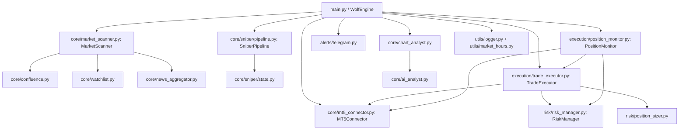

# Architecture

## System Overview
The system is orchestrated by `WolfEngine` in `main.py`, which wires together MT5 connectivity, scanning, optional M15 sniper logic, execution, risk controls, position monitoring, and alerts. The runtime is a long-lived loop with periodic scans, inter-cycle surveillance, and optional chart-based AI review (`main.py`, `core/chart_analyst.py`).

## Core Components and Responsibilities
- **Orchestrator** — `WolfEngine` handles lifecycle, loops, and coordination of all subsystems (`main.py`).
- **MT5 Adapter** — `MT5Connector` encapsulates MT5 initialize/reconnect, data access, and order operations (`core/mt5_connector.py`).
- **Market Scanner** — `MarketScanner` builds the trading universe and populates the watchlist via multi-timeframe analysis (`core/market_scanner.py`).
- **Watchlist + Triggers** — `Watchlist` and `WatchlistEntry` enforce the scan → stalk → trigger flow and build `TradeSignal` objects (`core/watchlist.py`, `core/signals.py`).
- **Confluence Engine** — `SymbolAnalysis`, `TimeframeAnalysis`, and `compute_confluence_score()` implement Pristine-based scoring and signal quality gates (`core/confluence.py`, `core/pristine.py`).
- **Sniper Pipeline (optional)** — `SniperPipeline` plus `TPR/RBH/ECR` logic for M15 event-driven trades, producing `ExecutionIntent` (`core/sniper/pipeline.py`, `core/sniper/state.py`, `core/sniper/tpr.py`, `core/sniper/rbh.py`, `core/sniper/ecr.py`).
- **Execution** — `TradeExecutor` validates, sizes, and submits orders; handles SL/TP modifications and closes (`execution/trade_executor.py`).
- **Position Management** — `PositionMonitor` manages open trades with Pristine methodology and fast tick checks (`execution/position_monitor.py`).
- **Risk Management** — `RiskManager` enforces limits, cooldowns, drawdown halts, and persists state (`risk/risk_manager.py`).
- **Sizing** — `compute_position_size()` applies Kelly-based sizing with hard caps (`risk/position_sizer.py`, `risk/kelly.py`).
- **Alerts** — `TelegramAlerter` sends non-blocking notifications (`alerts/telegram.py`).
- **AI/Chart Analysis** — `chart_analyst` renders charts and performs GPT-based visual checks; `ai_analyst` supplies general LLM utilities (`core/chart_analyst.py`, `core/ai_analyst.py`).
- **News/Events** — `news_aggregator` provides high-impact event windows for avoidance (`core/news_aggregator.py`).
- **Utilities** — logging and market-hours/session logic (`utils/logger.py`, `utils/market_hours.py`).

## Module Boundaries and Dependency Graph

## Key Design Decisions and Tradeoffs
- **Watchlist gating**: full scans never auto-execute; all entries must pass M15 trigger checks in `Watchlist.check_triggers()` to create `TradeSignal` objects (`core/market_scanner.py`, `core/watchlist.py`). This reduces false positives but adds latency.
- **Sequential scanning**: the scanner iterates symbols sequentially because the MT5 Python API is not thread-safe (`core/market_scanner.py`).
- **Risk state persistence**: daily/weekly PnL, halts, and cooldowns are persisted to disk to survive restarts (`risk/risk_manager.py`).
- **Chart analysis as risk scaler**: GPT chart analysis can reduce risk or veto marginal trades but defaults to risk_factor=1.0 on failure, so execution is not blocked by AI outages (`core/chart_analyst.py`, `main.py`).
- **Sniper mode bypass**: `SNIPER_MODE` switches to an M15-only event-driven pipeline, trading without higher-timeframe gates (`config.py`, `main.py`, `core/sniper/pipeline.py`).
- **Reconnection resilience**: `MT5Connector.ensure_connected()` retries and raises after failures to prevent silent trading on a dead connection (`core/mt5_connector.py`).

## Repository Evidence Index
- `main.py` — `WolfEngine` initialization, runtime loops, and orchestration.
- `core/mt5_connector.py` — MT5 connectivity, data retrieval, orders, positions, history.
- `core/market_scanner.py` — full scan, watchlist population, event filtering.
- `core/watchlist.py` — M15 trigger detection and signal creation.
- `core/confluence.py` / `core/pristine.py` — confluence scoring and Pristine method logic.
- `core/sniper/pipeline.py` / `core/sniper/state.py` — M15 sniper pipeline and state model.
- `execution/trade_executor.py` / `execution/position_monitor.py` — execution and trade lifecycle.
- `risk/risk_manager.py` / `risk/position_sizer.py` / `risk/kelly.py` — risk, sizing, and caps.
- `alerts/telegram.py` / `core/chart_analyst.py` / `core/ai_analyst.py` — alerts and AI analysis.
- `utils/logger.py` / `utils/market_hours.py` — logging and market session logic.
