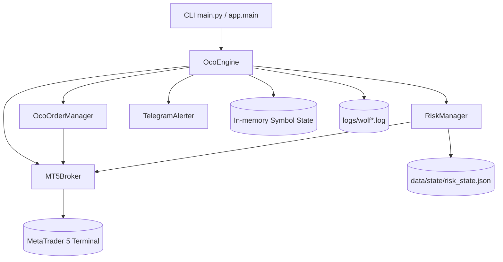

# Architecture — OCO Breakout Trading System

## 1) System Overview

The system is a single-process, event-loop trading runtime that executes a pure OCO breakout strategy on MT5. It is structured in layers:

- Interface layer: CLI entrypoints (`main.py`, `app/main.py`)
- Strategy/runtime layer: OCO orchestration (`oco/engine.py`)
- Execution layer: OCO order operations (`oco/order_manager.py`)
- Broker adapter layer: MT5 API abstraction (`brokers/mt5.py`)
- Risk layer: account-level and symbol-level limits (`risk/manager.py`)
- Support layer: logging and alerts (`utils/logger.py`, `alerts/telegram.py`)

## 2) Component Diagram

```mermaid
flowchart TD
    A[CLI main.py / app.main] --> B[OcoEngine]
    B --> C[RiskManager]
    B --> D[OcoOrderManager]
    B --> E[MT5Broker]
    B --> F[TelegramAlerter]
    D --> E
    C --> E
    E --> G[(MetaTrader 5 Terminal)]
    B --> H[(In-memory Symbol State)]
    C --> I[(data/state/risk_state.json)]
    B --> J[(logs/wolf*.log)]
```

## 3) Runtime Lifecycle

### Startup

1. `app.main.main()` configures logging and parses CLI.
2. `OcoEngine.start()`:
   - Connects to MT5.
   - Validates hedging account model.
   - Selects configured symbols.
   - Cancels stale pending orders for clean startup.
   - Adopts compatible open OCO positions into runtime state.
   - Sends bot start alert to Telegram (if enabled).

### Continuous Loop

Per loop iteration:

1. Check market session gate (`_is_market_open`).
2. Build one risk cycle snapshot (`RiskManager.begin_cycle`) for efficiency.
3. Process each symbol (`_process_symbol`):
   - Read tick, positions, pending orders.
   - Evaluate risk limits.
   - Manage active position or arm OCO pending pair.
4. Update telemetry and status logs.
5. Sleep using adaptive cadence (`_compute_loop_sleep`) if enabled.

### Shutdown

- SIGINT/SIGTERM sets `_shutdown_requested`.
- Engine completes current cycle, disconnects MT5, sends stop alert.

## 4) Internal State Model

Each symbol has an `OcoSymbolState` in memory:

- Arming state: `armed_at`, `arm_expires_at`, `arm_id`, `buy_ticket`, `sell_ticket`
- Position state: `position_ticket`, `position_side`, `entry_price`, `entry_ts`
- SL/trailing state: `sl_distance`, `best_price`
- Cooldown state: `cooldown_until`
- Setup cache state: `setup_cached`, `setup_cached_at`, `setup_cached_spread`

State is not persisted for strategy continuity; on restart, open OCO positions are re-adopted from broker state.

## 5) Risk Architecture

`RiskManager` enforces:

- Max drawdown (permanent halt)
- Daily/weekly loss limits
- Inventory and notional/leverage caps
- Margin-level halts/cautions
- Consecutive error fail-safe

Risk state persistence (`data/state/risk_state.json`) stores halt and equity baselines across restarts.

## 6) Execution Architecture

`OcoOrderManager` is intentionally narrow:

- `place_stop`: places BUY_STOP / SELL_STOP pending entries
- `cancel`: removes pending order by ticket
- `close_position_by_ticket`: closes a specific hedged position
- `unwind_position`: emergency flatten logic with duplicate-send guard

All raw request execution and normalization are delegated to `MT5Broker`.

## 7) Adaptive/Performance Architecture

Current performance controls:

- Symbol info short cache in broker adapter
- Risk cycle snapshot per loop (shared across symbols)
- Setup cache with smart refresh windows and spread-shock forcing
- Adaptive loop sleep bounded by min/max limits
- Market-closed one-time cleanup guard

## 8) Logging and Observability

Two main runtime logs:

- Status log (`_log_status`): per-symbol lifecycle summary
- Telemetry log (`_log_telemetry`):
  - Loop latency (`avg_loop_ms`, `max_loop_ms`)
  - Current loop sleep (`sleep_s`)
  - Broker/order call counters
  - Per-symbol state/time/event/error distribution

## 9) Design Constraints and Guarantees

- Hedging account required.
- Strategy is deterministic per loop inputs.
- No guarantee of profitability; risk controls bound failure modes but do not remove market risk.
