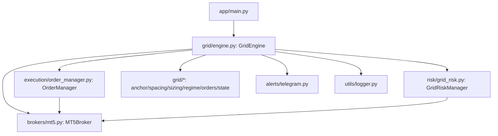

# Architecture

## System Overview
The system is a grid-only trading engine orchestrated by `GridEngine` (`grid/engine.py`) and launched via `app/main.py` (with a root `main.py` shim). It connects to MT5 through a broker adapter, computes grid parameters (anchor, spacing, sizing, regime), reconciles pending orders, and enforces risk controls and kill-switches.

## Core Components and Responsibilities
- **Orchestrator** — `GridEngine` manages lifecycle, state, and the main loop (`grid/engine.py`).
- **MT5 Adapter** — `MT5Broker` handles connection, market data, orders, and history (`brokers/mt5.py`).
- **Grid Logic** — anchor, spacing, sizing, regime, and rung state (`grid/anchor.py`, `grid/spacing.py`, `grid/sizing.py`, `grid/regime.py`, `grid/orders.py`, `grid/state.py`).
- **Order Reconciliation** — idempotent order placement and fill detection (`execution/order_manager.py`).
- **Risk Controls** — inventory limits, leverage caps, drawdown halts, and unwind (`risk/grid_risk.py`).
- **Alerts & Logs** — Telegram alerts and structured logging (`alerts/telegram.py`, `utils/logger.py`).
- **Backtesting** — bid/ask grid simulator (`backtest/grid_engine.py`, `backtest/fills.py`, `backtest/data.py`).

## Module Boundaries and Dependency Graph

```mermaid
graph TD
  app[app/main.py] --> engine[grid/engine.py: GridEngine]
  engine --> broker[brokers/mt5.py: MT5Broker]
  engine --> ordermgr[execution/order_manager.py: OrderManager]
  engine --> risk[risk/grid_risk.py: GridRiskManager]
  engine --> grid[grid/*: anchor/spacing/sizing/regime/orders/state]
  engine --> alerts[alerts/telegram.py]
  engine --> logs[utils/logger.py]

  ordermgr --> broker
  risk --> broker
```

## Key Design Decisions
- **Grid-only strategy**: all legacy Pristine/Sniper logic has been removed; grid is the sole trading mode.
- **Netting-safe**: order logic assumes MT5 netting and uses volume-based closes (no close-by or hedging-only logic).
- **Idempotent orders**: order comments encode grid/rung state to support reconciliation and restart recovery.
- **Risk-first**: inventory, leverage, and drawdown limits gate execution; halts trigger unwind and cancel orders.
