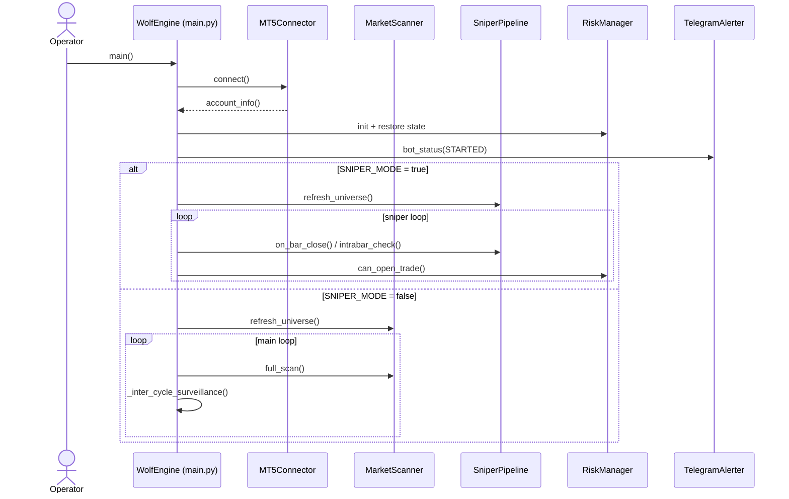
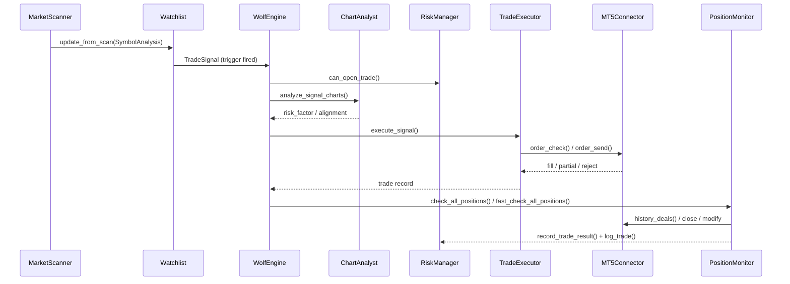

# Information Flow / Control Flow

## Who Decides What (Decision Authority)
- **Universe & data access** — `MT5Connector` selects symbols and provides rates/ticks (`core/mt5_connector.py`).
- **Setup qualification** — `MarketScanner` + `confluence` decide which symbols reach the watchlist (`core/market_scanner.py`, `core/confluence.py`).
- **Entry trigger** — `Watchlist.check_triggers()` decides when a setup becomes a `TradeSignal` (`core/watchlist.py`).
- **Sniper triggers** — `SniperPipeline.on_bar_close()` / `intrabar_check()` decide `ExecutionIntent` (`core/sniper/pipeline.py`).
- **Risk permission** — `RiskManager.can_open_trade()` is the master gate (`risk/risk_manager.py`).
- **Sizing** — `compute_position_size()` decides lot size based on Kelly + caps (`risk/position_sizer.py`).
- **Execution** — `TradeExecutor` validates and submits orders via MT5 (`execution/trade_executor.py`).
- **Trade lifecycle** — `PositionMonitor` decides modifications/partials/exits (`execution/position_monitor.py`).
- **AI risk scaling** — `chart_analyst.analyze_signal_charts()` can reduce risk or veto marginal trades (`core/chart_analyst.py`, `main.py`).

## Decision Points and Conditions (Key Gates)
1. **Connection health** — `MT5Connector.ensure_connected()` retries then raises on failure (`core/mt5_connector.py`).
2. **Market hours** — `market_hours.is_market_open()` / `is_new_trade_allowed()` block forex during closures and Friday wind-down (`utils/market_hours.py`, `main.py`, `core/watchlist.py`).
3. **High-impact events** — `news_aggregator.is_high_impact_event_window()` blocks scans around key events (`core/market_scanner.py`).
4. **Spread filters** — `spread_pips()` vs `MAX_SPREAD_PIPS` in scan and trigger stages (`core/mt5_connector.py`, `core/market_scanner.py`, `core/watchlist.py`).
5. **Confluence score** — `compute_confluence_score()` gates watchlist qualification (`core/confluence.py`, `core/market_scanner.py`).
6. **Trigger validity** — M15 closed-bar detection + stale feed checks (`core/watchlist.py`).
7. **Risk limits & cooldowns** — daily/weekly/drawdown halts, symbol cooldowns, correlation limits (`risk/risk_manager.py`).
8. **Chart analysis veto** — marginal setups can be skipped if GPT contradicts with low risk_factor (`main.py`, `core/chart_analyst.py`).
9. **Broker constraints** — STOPLEVEL minimums, filling mode, order_check validation (`execution/trade_executor.py`).

## Trade / Order State Transitions (Conceptual)
```
New Signal
  -> Risk Gate (allowed/blocked)
  -> Size Calculation (lots > 0)
  -> Order Check (valid/invalid)
  -> Order Send (market or pending; filled/partial/rejected)
  -> Open Position
     -> Modify SL/TP (trail/partial)
     -> Close (manual/SL/TP/weekend protection)
  -> Post-Trade Recording (journal + risk updates)
```
Sniper mode may create **pending orders** (`execute_intent()` → `_place_pending_order()`) in addition to market orders (`execution/trade_executor.py`).
Key lifecycle handlers: `TradeExecutor.modify_sl_tp()`, `TradeExecutor.close_position()`, `PositionMonitor.handle_closed_positions()` (`execution/trade_executor.py`, `execution/position_monitor.py`).

## Sequence Diagrams

### 1) Startup → connect → init → run loop


### 2) Market data update → signal → order → confirmation → monitoring → exit


## Repository Evidence Index
- `main.py` — main loop, `_process_signals()`, sniper loop.
- `core/watchlist.py` — trigger detection and signal creation.
- `risk/risk_manager.py` — `can_open_trade()` and halt logic.
- `execution/trade_executor.py` — execution sequence and broker validation.
- `execution/position_monitor.py` — lifecycle management and PnL recording.
- `core/chart_analyst.py` — AI chart analysis and risk factor output.
