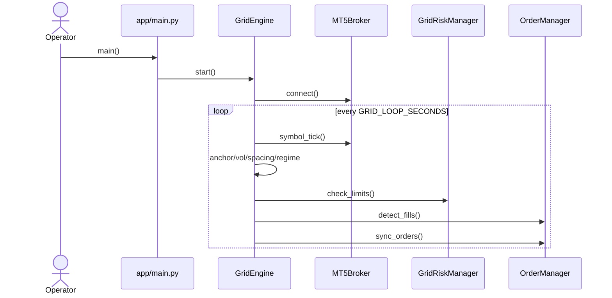

# Control Flow

## Decision Authority
- **Market data** — `MT5Broker` provides ticks, bars, orders, and positions (`brokers/mt5.py`).
- **Grid parameters** — `GridEngine` computes anchor/spacing/center and regime (`grid/engine.py`).
- **Risk gate** — `GridRiskManager.check_limits()` enforces limits and halts (`risk/grid_risk.py`).
- **Order reconciliation** — `OrderManager.sync_orders()` ensures desired orders match broker state (`execution/order_manager.py`).

## Main Loop (Per Symbol)
1. **Connect and health check** — `MT5Broker.ensure_connected()`.
2. **Tick read** — `symbol_tick()` for bid/ask and spread.
3. **Anchor & vol update** — EMA anchor + EWMA vol (`grid/anchor.py`, `grid/spacing.py`).
4. **Spacing/center compute** — cost-aware spacing and inventory-skewed center.
5. **Regime check** — trend/vol/spread gating (`grid/regime.py`).
6. **Risk gate** — drawdown, leverage, inventory caps; set HALT if needed (`risk/grid_risk.py`).
7. **Reset logic** — re-anchor grid when center drift exceeds threshold.
8. **Fill detection** — reconcile deals → update rung states (`execution/order_manager.py`, `grid/orders.py`).
9. **Order reconciliation** — place/cancel/replace to match desired grid.
10. **Persist state** — grid state and risk state saved to disk.

## Sequence Diagram

```mermaid
sequenceDiagram
  actor Operator
  participant App as app/main.py
  participant Engine as GridEngine
  participant Broker as MT5Broker
  participant Risk as GridRiskManager
  participant Orders as OrderManager

  Operator->>App: main()
  App->>Engine: start()
  Engine->>Broker: connect()
  loop every GRID_LOOP_SECONDS
    Engine->>Broker: symbol_tick()
    Engine->>Engine: anchor/vol/spacing/regime
    Engine->>Risk: check_limits()
    Engine->>Orders: detect_fills()
    Engine->>Orders: sync_orders()
  end
```

## Operational States
- **ACTIVE**: grid orders enabled, normal sizing.
- **CAUTION**: regime is trending; size reduced.
- **PAUSED**: grid entries disabled; exit orders only.
- **HALTED**: risk kill-switch; orders canceled, unwind attempted.
