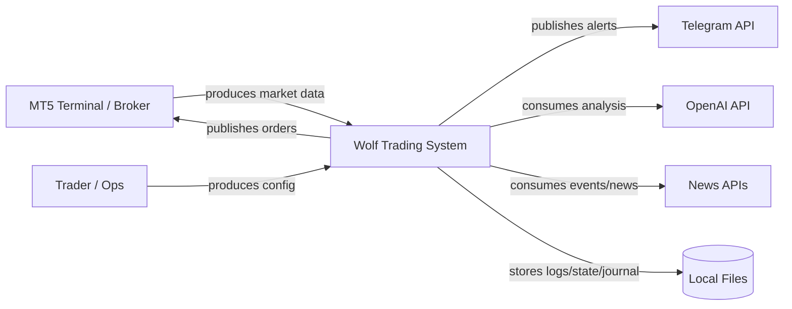
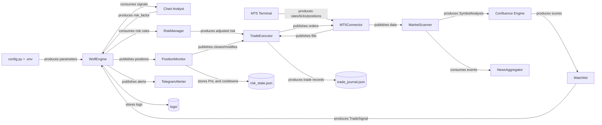

# Data Flow

## Overview
The system ingests market data from MT5, applies multi-timeframe analysis, stages candidates in a watchlist (or M15 sniper pipeline), validates triggers, applies risk and chart-based adjustments, executes orders through MT5, and manages positions until exit. Most state is in memory, with risk state and trade journals persisted to disk (`risk/risk_manager.py`).

## Primary Data Sources and Sinks
- **MT5 terminal / broker** — symbols, rates, ticks, positions, order checks/sends (`core/mt5_connector.py`).
- **Configuration** — `.env` and `config.py` define runtime parameters and secrets.
- **News APIs** — optional event windows and news aggregation (`core/news_aggregator.py`).
- **OpenAI** — optional chart analysis and AI utilities (`core/chart_analyst.py`, `core/ai_analyst.py`).
- **Telegram** — alerts (`alerts/telegram.py`).
- **Disk** — logs (`logs/`), trade journal (`data/trade_journal.json`), risk state (`data/risk_state.json`), news cache (`data/news_cache.json`), chart analysis artifacts (`logs/chart_analysis/`).

## Key Data Objects (Internal)
- `TimeframeAnalysis`, `SymbolAnalysis` — multi-timeframe analysis and scoring (`core/confluence.py`).
- `WatchlistEntry` — watchlist state (score, levels, metadata) (`core/watchlist.py`).
- `TradeSignal` — validated execution-ready signal (`core/signals.py`).
- `M15Snapshot`, `FastCandidate`, `SymbolState`, `ExecutionIntent` — sniper pipeline state and intents (`core/sniper/state.py`).
- Trade journal entries — `OPEN`, `CLOSE`, `CHART_ANALYSIS` records (`risk/risk_manager.py`, `main.py`).

## State Management (In-Memory vs Persisted)
- **In-memory**
  - Watchlist entries and trigger cooldowns (`core/watchlist.py`).
  - Sniper pipeline states per symbol (`core/sniper/pipeline.py`, `core/sniper/state.py`).
  - Position monitor contexts (partial closes, breakeven flags) (`execution/position_monitor.py`).
- **Persisted to disk**
  - Risk state and cooldown history: `data/risk_state.json` (`risk/risk_manager.py`).
  - Trade journal: `data/trade_journal.json` (`risk/risk_manager.py`).
  - News cache: `data/news_cache.json` (`core/news_aggregator.py`).
  - Chart analysis artifacts: `logs/chart_analysis/...` (`core/chart_analyst.py`).

## End-to-End Flow (Default Watchlist Mode)
1. **Connect & initialize**
   - `WolfEngine.start()` connects to MT5 and logs account state (`main.py`, `core/mt5_connector.py`).
2. **Universe discovery**
   - `MarketScanner.refresh_universe()` pulls symbol names via `get_symbols_by_groups()` (`core/market_scanner.py`, `core/mt5_connector.py`, `config.py`).
3. **Full scan**
   - `MarketScanner.full_scan()` loops sequentially (MT5 API not thread-safe) and calls `analyze_symbol()` (`core/market_scanner.py`, `core/confluence.py`).
4. **Watchlist population**
   - `Watchlist.update_from_scan()` adds qualifying setups and stores `SymbolAnalysis` metadata (`core/watchlist.py`).
5. **Trigger detection**
   - `Watchlist.check_triggers()` fetches M15 bars, validates data freshness, and detects triggers on CLOSED bars only (`core/watchlist.py`).
6. **Signal creation**
   - `_create_signal_from_trigger()` builds `TradeSignal` with fresh tick pricing and R:R/spread validation (`core/watchlist.py`, `core/signals.py`).
7. **Risk + chart analysis**
   - `WolfEngine._process_signals()` enforces market-hours gates, risk rules, and optional GPT chart analysis (`main.py`, `risk/risk_manager.py`, `core/chart_analyst.py`).
8. **Execution**
   - `TradeExecutor.execute_signal()` sizes via Kelly and submits order using MT5 order_check/order_send (`execution/trade_executor.py`, `risk/position_sizer.py`, `core/mt5_connector.py`).
9. **Position management**
   - `PositionMonitor.check_all_positions()` and `fast_check_all_positions()` adjust SL/TP, partials, and close positions (`execution/position_monitor.py`).
10. **Post-trade updates**
   - Closed positions are detected via history deals, PnL recorded, and risk/journal state persisted (`execution/position_monitor.py`, `risk/risk_manager.py`).

## End-to-End Flow (Sniper Mode)
1. **M15 event loop**
   - `WolfEngine._main_loop_sniper()` calls `SniperPipeline.on_bar_close()` on new M15 bars, and `intrabar_check()` between bars (`main.py`, `core/sniper/pipeline.py`).
2. **Execution intent**
   - Sniper setup detection (TPR/RBH/ECR) returns `ExecutionIntent` objects (`core/sniper/tpr.py`, `core/sniper/rbh.py`, `core/sniper/ecr.py`).
3. **Risk → Execute**
   - `TradeExecutor.execute_intent()` converts intent to order, applies sizing and MT5 validation (`execution/trade_executor.py`).
4. **Monitoring & lifecycle**
   - Same position management and risk/journal updates as default mode (`execution/position_monitor.py`, `risk/risk_manager.py`).

## Validation and Quality Gates (Where Data Is Checked)
- **Market hours & sessions**: `market_hours.is_market_open()` / `is_new_trade_allowed()` (`utils/market_hours.py`, `main.py`, `core/watchlist.py`).
- **High-impact events**: `news_aggregator.is_high_impact_event_window()` in scan stage (`core/market_scanner.py`, `core/news_aggregator.py`).
- **Spread filters**: `spread_pips()` checks in scan and signal creation (`core/mt5_connector.py`, `core/market_scanner.py`, `core/watchlist.py`).
- **Trigger data freshness**: stale feed detection by bar age (`core/watchlist.py`).
- **Risk manager gates**: cooldowns, max positions, correlations, margin level (`risk/risk_manager.py`).
- **Order validation**: broker STOPLEVEL adjustments and MT5 `order_check` before send (`execution/trade_executor.py`).

## Mermaid Diagrams

### Level-0 Context Diagram

### Level-1 Data Flow Diagram

### Level-2 Strategy Pipeline (Signals → Risk → Execution)

```mermaid
flowchart LR
  scan[Full Scan] -->|produces SymbolAnalysis| wl[Watchlist]
  wl -->|produces TradeSignal| signal[Signal]
  signal -->|consumes chart analysis| chart[Chart Analyst]
  chart -->|produces risk_factor| riskgate[Risk Gate]
  signal -->|consumes risk rules| riskgate
  riskgate -->|produces sized order| sizer[Position Sizer]
  sizer -->|publishes order request| order[Trade Executor]
  order -->|publishes order| mt5[MT5]
  mt5 -->|produces fills| pos[Open Position]
  pos -->|produces updates| monitor[Position Monitor]
  monitor -->|publishes closes/modifies| mt5
  monitor -->|stores journal entries| journal[(trade_journal.json)]
```

## Repository Evidence Index
- `core/mt5_connector.py` — `get_rates()`, `symbol_tick()`, `order_check()`, `order_send()` data sources.
- `core/market_scanner.py` — scan → watchlist population, event filtering.
- `core/watchlist.py` — trigger detection, `TradeSignal` creation.
- `core/confluence.py` — `SymbolAnalysis` and scoring pipeline.
- `core/sniper/pipeline.py` / `core/sniper/state.py` — sniper data and intents.
- `execution/trade_executor.py` — risk gate, sizing, order validation, execution.
- `execution/position_monitor.py` — post-trade monitoring and exits.
- `risk/risk_manager.py` — persistence and journal writes.
- `core/chart_analyst.py` / `core/ai_analyst.py` — optional AI flow.
