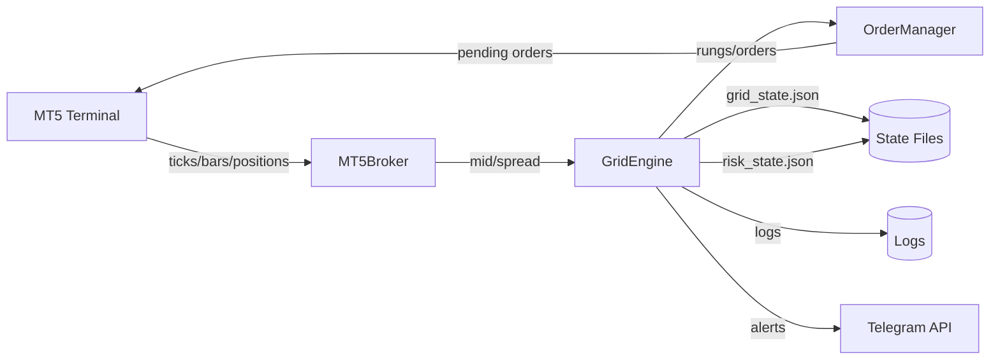

# Data Flow

## Primary Sources and Sinks
- **MT5 Terminal / Broker** — ticks, bars, positions, orders (`brokers/mt5.py`).
- **Config** — `.env` and `config/settings.py`.
- **Disk** — grid state (`data/state/grid_state.json`), risk state (`data/state/risk_state.json`), trade journal (`data/trade_journal.json`), logs (`logs/`).
- **Telegram** — alerts (`alerts/telegram.py`).

## Key Data Objects
- **GridState / GridRung** — persistent grid state and per-rung state (`grid/state.py`).
- **OrderSpec** — desired order definitions (`grid/orders.py`).
- **FillEvent** — detected fills from MT5 history (`execution/order_manager.py`).
- **RiskStatus** — risk gate outputs (`risk/grid_risk.py`).

## End-to-End Flow
1. **Ticks → Features**: `symbol_tick()` → mid, spread → anchor/vol/regime.
2. **State Update**: grid center/spacing, rung states, fill transitions.
3. **Order Reconcile**: desired order set → MT5 pending orders.
4. **Persistence**: grid/risk state to disk, logs to files.
5. **Alerts**: Telegram safety and status messages.

## Mermaid Data Flow

```mermaid
flowchart LR
  mt5[MT5 Terminal] -->|ticks/bars/positions| broker[MT5Broker]
  broker -->|mid/spread| engine[GridEngine]
  engine -->|rungs/orders| ordermgr[OrderManager]
  ordermgr -->|pending orders| mt5

  engine -->|grid_state.json| state[(State Files)]
  engine -->|risk_state.json| state
  engine -->|logs| logs[(Logs)]
  engine -->|alerts| telegram[Telegram API]
```
