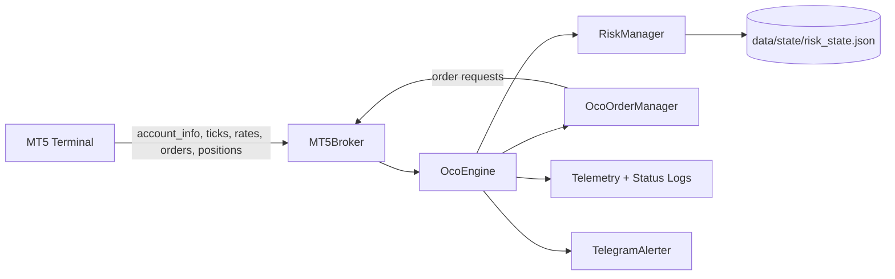
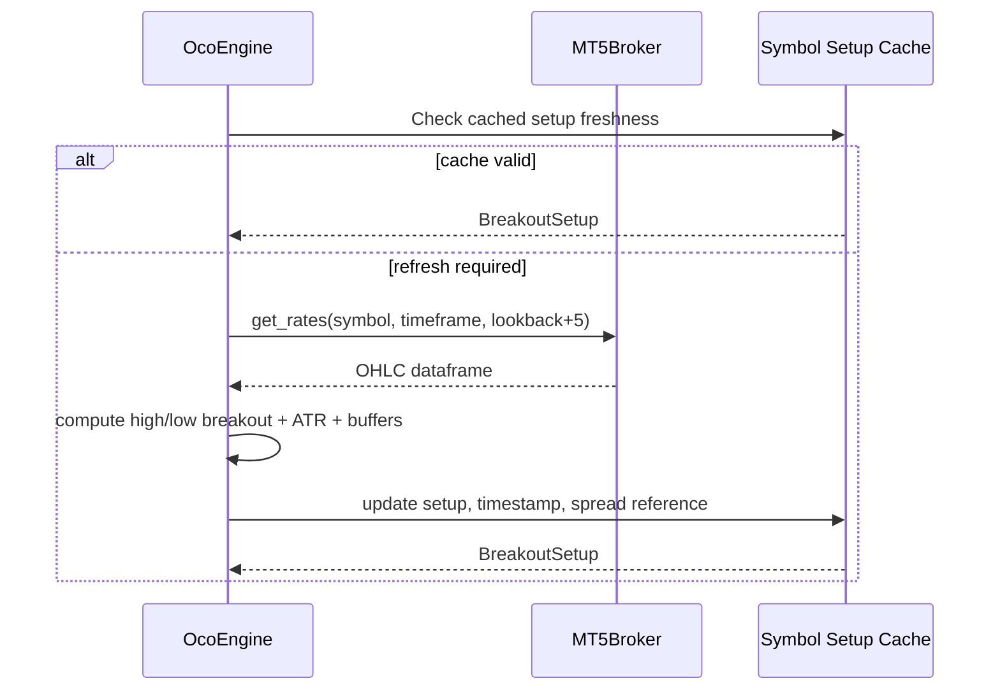
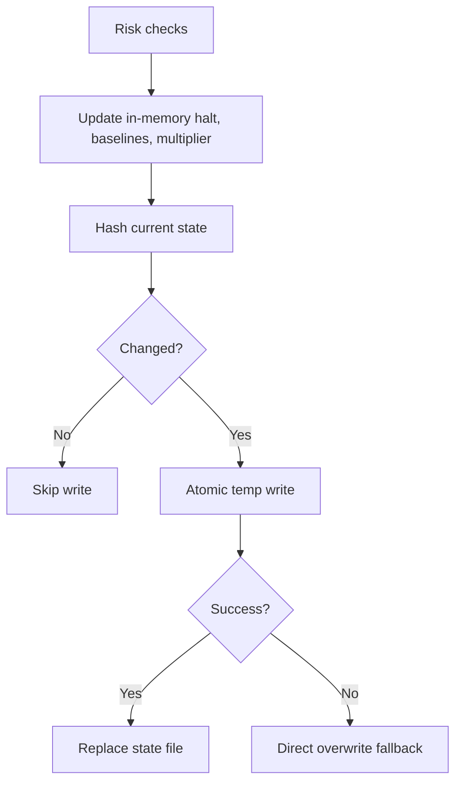

# Data Flow — OCO Breakout Trading System

## 1) End-to-End Data Pipeline

```mermaid
flowchart LR
    A[MT5 Terminal] -->|account_info, ticks, rates, orders, positions| B[MT5Broker]
    B --> C[OcoEngine]
    C --> D[RiskManager]
    C --> E[OcoOrderManager]
    E -->|order requests| B
    C --> F[Telemetry + Status Logs]
    D --> G[(data/state/risk_state.json)]
    C --> H[TelegramAlerter]
```

## 2) Loop-Scoped Data Objects

Per cycle, the engine creates and consumes:

- Risk cycle snapshot (`RiskCycleContext`):
  - `account_info`
  - `account_notional`
- Per symbol:
  - Tick (`bid`, `ask`)
  - Open positions filtered by strategy magic
  - Pending orders filtered by strategy magic
  - Symbol info (`point`, `contract_size`, stops constraints)

## 3) Breakout Setup Data Path

```mermaid
sequenceDiagram
    participant Eng as OcoEngine
    participant Brk as MT5Broker
    participant Cache as Symbol Setup Cache

    Eng->>Cache: Check cached setup freshness
    alt cache valid
        Cache-->>Eng: BreakoutSetup
    else refresh required
        Eng->>Brk: get_rates(symbol, timeframe, lookback+5)
        Brk-->>Eng: OHLC dataframe
        Eng->>Eng: compute high/low breakout + ATR + buffers
        Eng->>Cache: update setup, timestamp, spread reference
        Cache-->>Eng: BreakoutSetup
    end
```

Derived setup fields:

- `buy_stop`
- `sell_stop`
- `sl_distance`

## 4) Decision Data Path

For each symbol:

1. Market microstate input:
   - `tick`, `positions`, `pending`, `symbol_info`
2. Derived metrics:
   - `mid`, `spread`, `inventory_lots`, `notional`
3. Risk output:
   - `RiskStatus(halted, reason, risk_multiplier, warnings)`
4. Strategy action:
   - flatten, manage position, arm pair, or wait

## 5) Order Request Payload Flow

Order placement uses this payload path:

1. `OcoEngine` builds `PendingSpec`
2. `OcoOrderManager.place_stop` normalizes price/volume
3. `MT5Broker.check_order` pre-validates with broker
4. `MT5Broker.send_order` submits and retries on retriable retcodes

Close path:

1. Position SLTP modifications via `modify_position_tp`
2. Time-stop or unwind via `close_position` / `close_position_by_ticket`

## 6) Risk Data Persistence Flow

```mermaid
flowchart TD
    A[Risk checks] --> B[Update in-memory halt, baselines, multiplier]
    B --> C[Hash current state]
    C --> D{Changed?}
    D -- No --> E[Skip write]
    D -- Yes --> F[Atomic temp write]
    F --> G{Success?}
    G -- Yes --> H[Replace state file]
    G -- No --> I[Direct overwrite fallback]
```

## 7) Telemetry Data Flow

Collected during loop:

- Loop metrics: cycle latency, selected sleep interval
- Call metrics: broker method counts, order manager method counts
- Symbol metrics: decision bucket counts and event counters

Logged periodically under `OCO telemetry` lines.

## 8) Error and Recovery Flow

On per-symbol exception:

1. Symbol error counter increments
2. Risk consecutive-error tracker increments
3. Exception stack logged
4. Loop continues for remaining symbols

After enough consecutive errors, risk enters halt (`consecutive_errors`).
