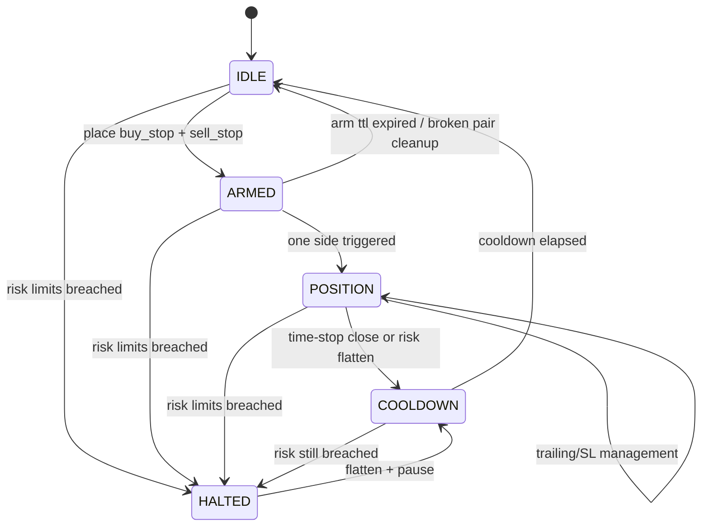
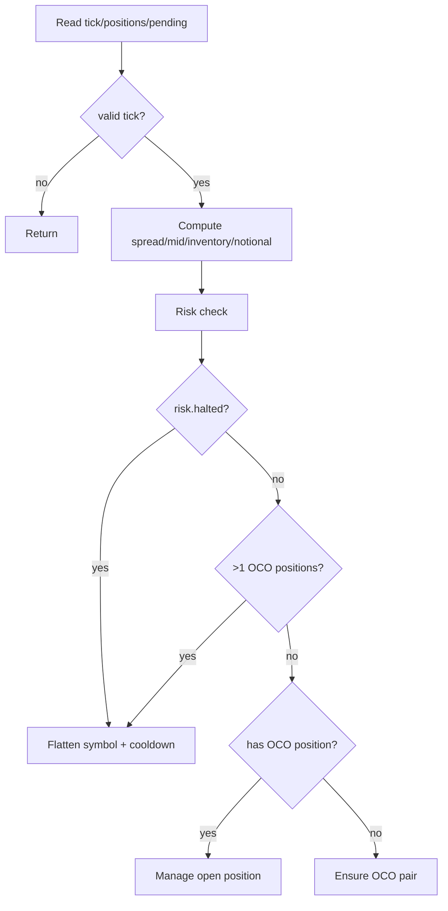

# Decision Flow — OCO Runtime Logic

## 1) Symbol State Machine

## 2) Top-Level Per-Symbol Decision Tree

## 3) Ensure OCO Pair Logic

Branch order in `_ensure_oco_orders`:

1. Cooldown gate:
   - If cooldown active, cancel any OCO pending remnants and return.
2. Existing pair validity:
   - If both tickets still present and TTL valid, keep as-is.
3. Broken pair detection:
   - If only one side remains pending, cancel all OCO pending and reset arm state.
4. TTL expiry:
   - If arm expired, cancel pending and reset arm state.
5. Setup acquisition:
   - Use cached setup when valid; refresh from rates if needed.
6. Size calculation:
   - Base lots × OCO size multiplier × risk multiplier.
7. Dual placement:
   - Place buy stop and sell stop.
   - On partial failure, cancel and reset.
8. Arm commit:
   - Store tickets, arm timestamps, SL distance.

## 4) Open Position Management Logic

Branch order in `_manage_open_position`:

1. Cancel opposite/leftover OCO pending orders.
2. On first seen position ticket in current runtime:
   - Initialize state tracking (`entry_ts`, `entry_price`, `best_price`, `sl_distance`).
3. Ensure baseline SL exists:
   - If no SL on broker position, set initial SL at entry ± `sl_distance`.
4. Trailing activation:
   - Activate when gain ≥ `sl_distance * OCO_TRAIL_ACTIVATE_R`.
   - Tighten SL based on best favorable price and trail spacing multiplier.
5. Time stop:
   - If hold time exceeds `OCO_TIME_STOP_SECONDS`, close position and enter cooldown.

## 5) Risk Halt Decision Order

`RiskManager.check_limits` computes halts in this order:

1. Permanent halt short-circuit (`max_drawdown` persisted)
2. Account data sanity (`equity/balance`)
3. Inventory cap
4. Drawdown and warning zone
5. Daily and weekly loss limits
6. Leverage and notional limits
7. Margin level limits
8. Consecutive-error fail-safe

First matched halt reason becomes active `halt_reason`.

## 6) Adaptive Loop Sleep Decision

From `_compute_loop_sleep`:

- Base: `OCO_LOOP_SECONDS`
- Faster mode:
  - Any symbol in `POSITION` or `HALTED`
- Medium mode:
  - Any symbol in `ARMED`
- Slower mode:
  - All symbols idle/cooldown
- Load correction:
  - If cycle load ratio is high, expand target sleep
- Smoothing:
  - Exponential blend with previous sleep
- Clamp:
  - `[OCO_LOOP_MIN_SECONDS, OCO_LOOP_MAX_SECONDS]`

## 7) Setup Cache Refresh Decision

Refresh window starts at `OCO_SETUP_REFRESH_SECONDS` and is modified by:

- Armed: faster refresh (×0.6)
- Cooldown: slower refresh (×2.0)
- Idle: slightly slower refresh (×1.5)
- Spread shock: additional slowdown if spread ratio exceeds threshold

If cache is fresh and spread shock absent, setup is reused.
