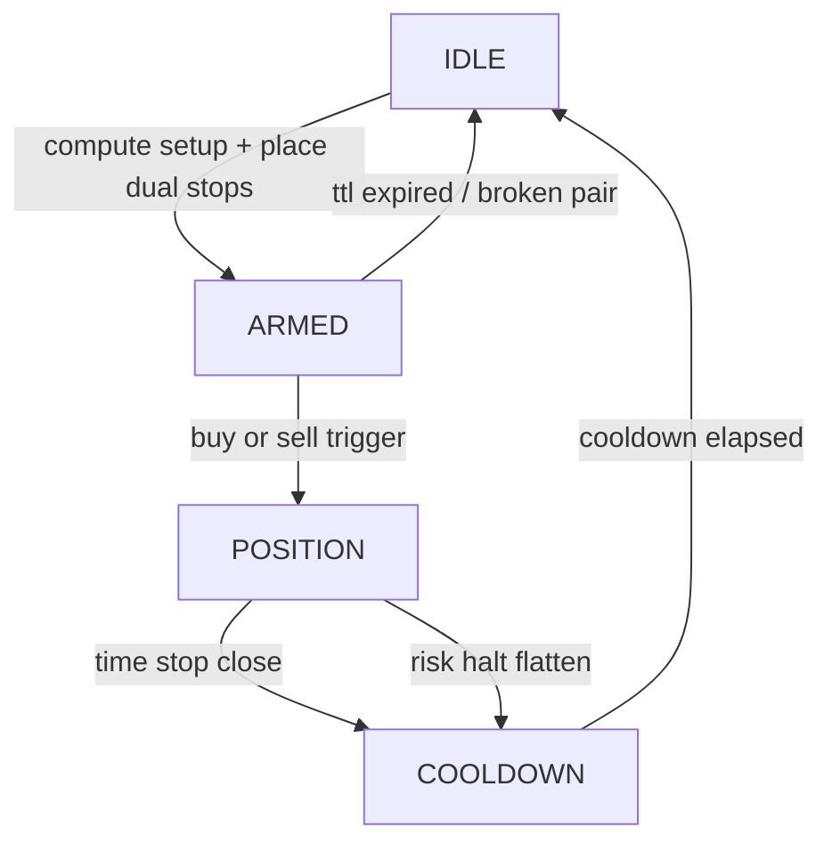

# OCO Strategy Specification — Implementation Accurate

## 1) Strategy Objective

Trade directional breakouts with capped per-trade risk by arming both sides of a breakout (BUY_STOP and SELL_STOP) and allowing only one side to survive once triggered.

Core design goals:

- Breakout participation in both directions
- Strict ownership and cleanup of pending orders
- Explicit lifecycle controls (SL, trailing, time-stop, cooldown)
- Account-level and symbol-level risk halts

## 2) Symbol-Level Lifecycle

## 3) Breakout Setup Mathematics

Given recent bars (`lookback = OCO_BREAKOUT_LOOKBACK`):

- Breakout high: $H = \max(\text{highs})$
- Breakout low: $L = \min(\text{lows})$
- Proxy ATR from true-range approximation:
  - $TR_i = high_i - low_i$
  - $ATR = \text{mean}(TR_{last\;\min(14,n)})$
  - lower-bounded by `point * 10`

Buffer:

$$
buffer = \max( OCO\_BUFFER\_ATR\_MULT \cdot ATR,
               OCO\_BUFFER\_SPREAD\_MULT \cdot spread,
               2 \cdot point )
$$

Entry stop levels:

- `buy_stop = H + buffer`
- `sell_stop = L - buffer`

Initial SL distance:

$$
sl\_distance = \max(OCO\_SL\_SPACING\_MULT \cdot ATR, 10 \cdot point)
$$

## 4) Entry Arming Rules

Arming occurs only if:

- Symbol is not cooling down
- No active position exists for symbol
- Existing pair is absent or stale/invalid and has been cleaned
- Setup generation succeeds
- Normalized volume > 0 after risk multiplier scaling
- Broker checks pass for both pending stop orders

Volume formula:

$$
volume = normalize\_volume(BASE\_ORDER\_SIZE\_LOTS \cdot OCO\_SIZE\_MULT \cdot risk\_multiplier)
$$

## 5) Pending Pair Integrity Rules

If pair integrity breaks (only one pending ticket remains), runtime cancels residual OCO pending orders and resets arm state to avoid accidental one-sided exposure.

Arm TTL:

- Pair expires at `armed_at + OCO_ARM_TTL_SECONDS`.
- Expired pair is canceled and recreated from fresh setup.

## 6) Open Position Management Rules

When position exists:

1. Cancel remaining OCO pending orders.
2. Initialize runtime position tracking if newly observed.
3. Ensure baseline SL is present on broker position.
4. Apply trailing only after activation threshold.
5. Close by time-stop when max hold duration is reached.

### Trailing Activation

- Long gain: `bid - entry_price`
- Short gain: `entry_price - ask`
- Activate when gain >= `sl_distance * OCO_TRAIL_ACTIVATE_R`

Trail gap:

$$
trail\_gap = sl\_distance \cdot OCO\_TRAIL\_SPACING\_MULT
$$

Candidate trailing SL:

- Long: `best_price - trail_gap`
- Short: `best_price + trail_gap`

Only tighten in favorable direction and never beyond current market side constraints.

## 7) Time Stop and Cooldown

If elapsed hold time exceeds `OCO_TIME_STOP_SECONDS`:

- Position is closed by opposite side market action.
- Symbol enters cooldown until `now + OCO_REENTRY_COOLDOWN_SECONDS`.
- Arm and position state fields are reset.

## 8) Risk Governance

Risk check runs for each symbol using cycle snapshot data.

### Limits Enforced

- Drawdown cap (`MAX_DRAWDOWN_PCT`) with permanent halt behavior
- Daily loss cap (`DAILY_LOSS_LIMIT_PCT`)
- Weekly loss cap (`WEEKLY_LOSS_LIMIT_PCT`)
- Inventory cap (`MAX_INVENTORY_LOTS`)
- Leverage cap (`MAX_LEVERAGE`)
- Notional caps (`MAX_NOTIONAL_MULT_EQUITY`)
- Margin stress thresholds (halt/caution)
- Consecutive runtime error halt

On halt:

- Cancel pending for symbol
- Unwind open exposure for symbol
- Enter cooldown

## 9) Adaptive Execution Controls (Phase 5)

### Adaptive Loop Cadence

Enabled by `OCO_ADAPTIVE_LOOP_ENABLED`.

Behavior:

- Faster cadence when any symbol is in `POSITION` or `HALTED`
- Moderate cadence when any symbol is `ARMED`
- Slower cadence when all symbols are idle/cooldown
- Load-aware inflation if cycle processing time is high
- Exponential smoothing of sleep changes
- Clamp within [`OCO_LOOP_MIN_SECONDS`, `OCO_LOOP_MAX_SECONDS`]

### Smart Setup Refresh

Enabled by `OCO_SMART_SETUP_REFRESH_ENABLED`.

Base refresh window: `OCO_SETUP_REFRESH_SECONDS`, then modified by:

- Armed: faster refresh
- Cooldown: slower refresh
- Idle: moderately slower refresh
- Spread shock (ratio >= `OCO_SETUP_SPREAD_SHOCK_RATIO`): force earlier recalculation by invalidating reuse condition

## 10) Telemetry and Optimization Feedback

Telemetry emits:

- Loop performance (`avg_loop_ms`, `max_loop_ms`, `sleep_s`)
- Broker and order call counts
- Per-symbol:
  - state occupancy counts
  - arms/time-stops/flatten events
  - per-symbol processing latency
  - errors

This is the primary feedback channel for tuning cadence, setup refresh, and broker call pressure.

## 11) Failure Modes and Safe Behavior

### Anticipated Failure Modes

- MT5 disconnects
- Order rejections due to stops/filling constraints
- Symbol visibility or tick unavailability
- Slow or volatile spread conditions

### Safe Responses in Code

- Reconnect with exponential backoff
- Validate stop distance and normalize orders
- Cancel inconsistent pending states
- Enforce cooldown after forced closures
- Persist risk halt state across restart

## 12) Practical Tuning Priorities

Highest impact parameters:

1. `OCO_BREAKOUT_LOOKBACK`
2. `OCO_BUFFER_ATR_MULT` and `OCO_BUFFER_SPREAD_MULT`
3. `OCO_SL_SPACING_MULT`
4. `OCO_TRAIL_ACTIVATE_R` and `OCO_TRAIL_SPACING_MULT`
5. `OCO_TIME_STOP_SECONDS`
6. Adaptive loop and setup-refresh bounds

Tuning should be telemetry-driven and risk-first; never optimize entry aggressiveness without simultaneously validating drawdown and stop behavior.
